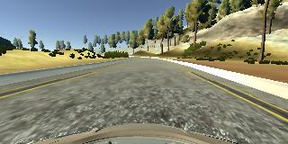
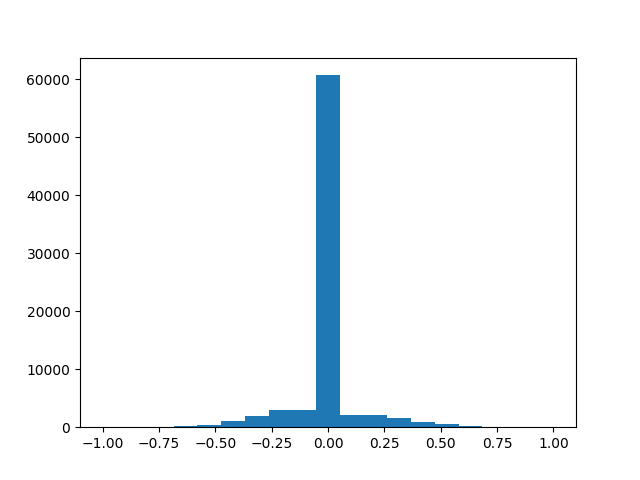

# Learning To Drive Using Behavioral Cloning


Overview
---
This repository contains code and other resources for Behavioral Cloning project for [Udacity Self-driving Car Nano Degree](https://in.udacity.com/course/self-driving-car-engineer-nanodegree--nd013/).

The aim of the project is to train a Deep Convolutional Neural Network(CNN) model to drive a car in a simulator by learning from data gathered by a human driver driving in the same simulator. While a simulator could produce lots of data, like steering angle, speed, throttle etc, this project focused on learning to predict the steering angle by looking at images captured from front facing cameras mounted on the car. 

The project had the following stages:
* Driving data was collected from a [simulator](https://d17h27t6h515a5.cloudfront.net/topher/2017/February/58ae46bb_linux-sim/linux-sim.zip) provided by Udaicty.
* A convolution neural network was built in Keras that predicts steering angles from images
* The model was trained on a subset of the images and steering angles from the collected data then tested on another subset of the data.
* The model was tested by letting it drive several laps in the simulator.
* Results were summarized in this README file.

### Dependencies
The following dependencies need to be installed to reproduce the results dicussed here.

* [CarND Term1 Starter Kit](https://github.com/udacity/CarND-Term1-Starter-Kit)

The lab enviroment can be created with CarND Term1 Starter Kit. Click [here](https://github.com/udacity/CarND-Term1-Starter-Kit/blob/master/README.md) for the details.

* Udacity Simulator
    * [Linux](https://d17h27t6h515a5.cloudfront.net/topher/2017/February/58ae46bb_linux-sim/linux-sim.zip)
    * [Windows](https://d17h27t6h515a5.cloudfront.net/topher/2017/February/58ae4419_windows-sim/windows-sim.zip)
    * [Mac](https://d17h27t6h515a5.cloudfront.net/topher/2017/February/58ae4594_mac-sim.app/mac-sim.app.zip)


## Details About Files In This Directory

### `model.h5`
Saved model file.

### `drive.py`

This file drives the car in autonomous mode. Usage of `drive.py` requires you have saved the trained model as an h5 file, i.e. `model.h5`. 

Once the model has been saved, it can be used with drive.py using this command:

```sh
python drive.py model.h5
```

The above command will load the trained model and use the model to make predictions on individual images in real-time and send the predicted angle back to the simulator.

Screenshots of autonomous driving can be saved to a folder. To do so pass a fourth argument in the command above.

```sh
python drive.py model.h5 <snapshots>
```

The fourth argument `snapshots` is the directory to save the images seen by the agent to. If the directory already exists it'll be overwritten.

### `video.py`
Then a video can be generated from the screenshots using the following command:


```sh
python video.py snapshots
```

Create a video based on images found in the `snapshots` directory. The name of the video will be name of the directory following by `'.mp4'`, so, in this case the video will be `snapshots.mp4`.

Optionally one can specify the FPS (frames per second) of the video:

```sh
python video.py snapshots --fps 48
```

The video will run at 48 FPS. The default FPS is 60.

### `model.py`
This file generates a Keras model from training data. The syntax for training is:

```sh
python model.py [<training_dat_dir>] [<model>] [<epochs>] [<train_batch_size>] [<test_batch_size>] [<model_name_suffix>]
```
- **training_dat_dir** is the directory where training images and driving logs are present. This directory should have a directory named `IMG` containing all training images and a file name 'driving_logs.csv' containing the driving logs generated by the simulator. If the parameter is omitted then the path `./training-data` will be used by default.

- **model** The CNN model architecture that will be trained. This can be `nvidia` which is the default or `lenet5` and is case insensitive.

- **epochs** The number of epochs to train for. Depends on the size of training data. Default is 5. Both models starts to overfit after 5 epochs.

- **train_batch_size** Size of one training batch. Default is 32.

- **test_batch_size** Batch size for testing. Default is 1 since the simulator asks for prediction on a single frame at a time.

- **model_name_suffix** By default the generated model is saved as simply model.h5. If a suffix is passed the file will be named `model-model_name_suffix.h5`


### `keras-vis.py`
This file generates activation maps from a model.h5 file. To generate the activation maps run the following command:

```sh
python keras-vis.py [<model>] [<img_dir>] [<layer>]
```
- **model** is the path to a model.h5 file.
- **img_dir** is the path to the directory containing images for which activation maps have to be generated.
- **layer** is an integer specifying the layer index for which activations are to be generated.

This will process each image and extract all activation maps for the image by runninng the model on the image and saving the output of the specified layer. The individual activation maps of an image are then combined into a single activation map and saved in `img_dir/responses/<model>/`. 

### `video.mp4`
A demostration video of autonomous driving.

# Model Design
This section describes how the model was built.

## Data Collection

### Simulator settings
The simulator was run at the lowest possible graphics settings. This was done to keep the CPU load low but discussions in the forums suggested that it was a good strategy to train on low resolution images.

### Data collection strategy
To collect human driving data, the simulator was run in training mode. The car was driven around the track using a keyboard for about 6 laps and driving data recorded. Then the direction was reversed and and another 3 laps were recorded. In addition a few short recordings were made of tricky parts of the track. The data recorded in the reverse direcion ensured that the model did not simply memorize the conditions of the forward lap and generalized well to test-time conditions. Some sharps turn were tricky and initial models would swerve wildly when negotiating them. The additional recordings helped the model stay in the middle of the road.

The simulator recorded screenshots taken from the perspective of 3 cameras mounted a the fron of the car at the left, center and a right of the hood. Alongwith these images the simulator also recorded the driving parameters at the instant an image was captured. These included steering angle, throttle and speed and were written to **driving_log.csv**. The images below show the same potion of the track from the left, center and right camera's perspective, respectively.

 
 
 

### Loading the data
There were about 80,000 images whose paths were recorded in **driving_log.csv**. So actual images were not loaded all at once, instead they were loaded a few samples at a time using a Python generator described later. However, all the driving logs were loaded and analyzed, but only a small number of logs retained, as described below.  

In [model.py](https://github.com/farhanhubble/CarND-Behavioral-Cloning-P3/blob/08ab6742c4b76a96857c5704f97038ece75f88aa/model.py#L48), the function `load_logs()` loads the driving logs. We passed `all_camera=True` to this function so it loaded the image paths of all three cameras and steering angles.

### Preprocessing
Models trained on the raw data showed a propensity to drive straight ahead. This was becasue the training data had a hugely disproportionate instances of driving straight. The distribution of steering anlgles in the raw data looked like this:

 

To remove this bias the logs were equalized by calling [`drop_zero_steering()`](https://github.com/farhanhubble/CarND-Behavioral-Cloning-P3/blob/08ab6742c4b76a96857c5704f97038ece75f88aa/model.py#L73). Driving logs for 75% percent of steering angles in the range [-0.05,0.05] were dropped. The percentage and range values are configurable via training options in the [code](https://github.com/farhanhubble/CarND-Behavioral-Cloning-P3/blob/08ab6742c4b76a96857c5704f97038ece75f88aa/model.py#L270).

In the equalized logs, steering angles were corrected for images taken from left and right cameras. The simulator records images from three cameras as discussed above. The steering angles for left camera were increased reinforcing the need for a harder right turn, while the angles for right camera were reduced by a similar amount. A correction factor of 0.2 as suggested in the lecture videos, was passed to [`correct_steering_angle()`](https://github.com/farhanhubble/CarND-Behavioral-Cloning-P3/blob/08ab6742c4b76a96857c5704f97038ece75f88aa/model.py#L18) The distribution of driving anlges after the preprocessing looked much less skewed.

 

## Model Architecture

### Lenet5 
The LeNet5 architecture was used initially. The [`Lenet5()`](https://github.com/farhanhubble/CarND-Behavioral-Cloning-P3/blob/08ab6742c4b76a96857c5704f97038ece75f88aa/model.py#L230) function returns a regression model that adapts the **LeNet5** classification model for our purpose, replacing the last dense layer of 10 neurons with a single neuron that predicts a real value (steering angle). The loss function has also been changed to mean squared loss (MSE) for regression. A cropping layer was later added to improve performance. The final model has the following layers

| Layer         | Layer Specs                                | Output Size |
|---------------|--------------------------------------------|-------------|
| Normalization | lambda x: x / 255 - 0.5                    | 160x320x3   |
| Cropping      | Cropping2D(cropping=((70, 25), (0, 0))     | 65x320x3    |
| Convolution   | 6, 5x5 kernels, 1x1 stride, valid padding  | 61x316x6    |
| RELU          | Non-linearity                              | 61x316x6    |
| MaxPooling    | Downsampling by a factor of 2              | 30x158x6    |
| Convolution   | 16, 5x5 kernels, 1x1 stride, valid pooling | 26x154x16   |
| RELU          | Non-linearity                              | 26x154x16   |
| MaxPooling    | Downsampling by a factor of 2              | 13x77x16    |
| Flatten       | Conversion to vector                       | 16016       |
| Dense         | Fully connected layer. No regularization   | 120         |
| Dense         | Fully connected layer. No regularization   | 84          |
| Dense         | Output layer                               | 1           |

A LeNet5 model had 1,935,161 parameters. The model was slow to learn, owing to the large number of parameters, but seemed to train well, and could drive almost through the entire track. However excruciatingly slow download speeds from AWS meant that downloading and testing the model was consuming most of the time.

### Nvidia model
The Nvidia model was initially the exact model described by Nvidia reserachers in their [paper](https://arxiv.org/pdf/1604.07316.pdf) titled **"End to End Learning for Self-Driving Cars"**, except that the input layer was 160x320. A cropping layer was later added to improve performance and ropout layers were added to mitigate any over-fitting, becasue the training data was from a small, single driving track. Once again mean sqaured loss (MSE) was used and The final architecture looked like below:

| Layer         | Layer Specs                                | Output Size |
|---------------|--------------------------------------------|-------------|
| Normalization | lambda x: x / 255 - 0.5                    | 160x320x3   |
| Cropping      | Cropping2D(cropping=((70, 25), (0, 0))     | 65x320x3    |
| Convolution   | 24, 5x5 kernels, 2x2 stride, valid padding | 31x158x24   |
| RELU          | Non-linearity                              | 31x158x24   |
| Dropout       | Probabilistic regularization (p=0.2)       | 31x158x24   |
| Convolution   | 36, 5x5 kernels, 2x2 stride, valid padding | 14x77x36    |
| RELU          | Non-linearity                              | 14x77x36    |
| Dropout       | Probabilistic regularization (p=0.2)       | 14x77x36    |
| Convolution   | 48, 5x5 kernels, 1x1 stride, valid padding | 5x37x48     |
| RELU          | Non-linearity                              | 5x37x48     |
| Dropout       | Probabilistic regularization (p=0.1)       | 5x37x48     |
| Convolution   | 64, 3x3 kernels, 1x1 stride, valid padding | 3x35x64     |
| RELU          | Non-linearity                              | 3x35x64     |
| Dropout       | Probabilistic regularization (p=0.1)       | 3x35x64     |
| Convolution   | 64, 3x3 kernels, 1x1 stride, valid padding | 1x33x64     |
| RELU          | Non-linearity                              | 1x33x64     |
| Dropout       | Probabilistic regularization (p=0.1)       | 1x33x64     |
| Flatten       | Convert to vector.                         | 2112        |
| Dense         | Fully connected layer. No regularization   | 100         |
| Dropout       | Probabilistic regularization (p=0.5)       | 100         |
| Dense         | Fully connected layer. No regularization   | 50          |
| Dropout       | Probabilistic regularization (p=0.3)       | 50          |
| Dense         | Fully connected layer. No regularization   | 10          |
| Dense         | Output prediction layer.                   | 1           |

Although the Nvidia model is taller it has only 348,219 parameters and is much faster to train. So the Nvidia model was selected and fine-tuned on a local machine.

## Model Training and Testing.

### Training

In the preprocessing step, out of 77979 saples in the log file 44453 were dropped and the remaining were split into 18774 training, 4694 validation and 10058 test samples. This was done by calling [`process_logs()`](https://github.com/farhanhubble/CarND-Behavioral-Cloning-P3/blob/08ab6742c4b76a96857c5704f97038ece75f88aa/model.py#L93). 

The train-test split was done in 70:30 ratio and then 20% of training data was reserved for validation. The function [`data_generator()`](https://github.com/farhanhubble/CarND-Behavioral-Cloning-P3/blob/08ab6742c4b76a96857c5704f97038ece75f88aa/model.py#L157) returns a generator. It was used to create training, validation and test generators.

The training generator was configured to use a batch size of 32 but it fetched only 16 samples from the training data and then add another 16 samples by horizontally flipping the original 16 images and negating their steering angles. So effectively the number of training samples doubled to 2x18774 samples.

The validation generator fetched 32 images from the validation data and did not use flipped images. 

These generators were used to train the Nvidia model using mean squared loss metric and Adam optimizer. Adam was chosen because it works well with its default learning rate.

The training was run for 5 epochs as validation loss would start increasing beyond that. The final training loss was 0.323, while the validation loss was 0.316.

The code and parameters for training can be viewed [here](https://github.com/farhanhubble/CarND-Behavioral-Cloning-P3/blob/08ab6742c4b76a96857c5704f97038ece75f88aa/model.py#L293).

### Testing

The test data generator was configured to generate batches of a single sample only. This was kept to reproduce the deployment condition where only one frame(image) will be used at a time to get a prediction. The test loss was 0.32 and matched the training loss upto 2 decimal places.

### Interpreting The Loss

After several rounds of training and deployment it was evident that the numeric value of the losses was not an accurate predictor of the model's performance. Models with similar losses like 0.4... and 0.3... would perform very differently. Although the training, validation and testing losses always converged to a small value, it was hard to deduce the actual prediction accuracy and precision performance from this model. 

The steering angles in the raw data are normalized to [-1,1] and the loss values are generated by summing up the very small deltas between actual and predicted steering. The sum is inevitably a very small fractional number. The loss can be used to determine things, like if the model has some bug, or if there's overfitting but no conclusions can be drawn about the generalizing ability of the model.

### Sanity Checking The Model

Since the numerical value of loss could not be related to performance, a small number of test images were labeled with the actual and predicted images. A cople of labeled images are displayed below.


These images helped check if the model was making sensible predictions. The code for this sanity checking is refactored into the function [`preview_predictions()`](https://github.com/farhanhubble/CarND-Behavioral-Cloning-P3/blob/08ab6742c4b76a96857c5704f97038ece75f88aa/model.py#L332) which is only run if the '__DEBUG__' flag at the top of the file is True. 

Another function available in model.py [`label_snapshots()`](https://github.com/farhanhubble/CarND-Behavioral-Cloning-P3/blob/08ab6742c4b76a96857c5704f97038ece75f88aa/model.py#L348) also labels the images but it can label an entire directory instead of a handful of samples. The images to be labeled should be present in a folder named **snapshots/** inside the working directory. Insted of labeling the original images, labeled images are saved to **sanpshot-predictions/**.


### Improving The Model

Over the course of the training (the model was trained and evaluated a good 50 or more times) the following problems were identified and fixed as described below:

**Car Veering off course:**
Initially the Nvidia model drove well in autonomous mode except at shap curves, where it would veer off, often. Additonal training data from the tricky parts of the track helped improve the performance.

**Slow learning:**
An additional cropping layer was added to remove top 70 pixels and and bottom 25 pixels from the camera images. These portions contained views of the surrounding like trees or the hood of the car, which were not relevant to making a prediction, instead the model took more time to learn to overlook patterns in those areas. The cropping layer made the training process much faster and probably helped improve the final accuracy as well.

**Over-fitting:**
To overcome overfitting, the training set contined 50% flipped images that would normally be not seen on the test track. In additon, to bring the validation loss closer to training loss, dropout layers were added after each convolution and dense layer. The dropout probabilities were 0.3 for initial two convoltion layers and 0.1 for the last three layers. The first, and larger dense layer, has a higher dropout of 0.5 while the second dense layer had 0.3.

**Car swerving too much:**
This was most likely caused by the time delay between a frame capture by the simulator and the prediction being returned. The driving speed was set to 20MPH in drive.py, from 30MPH that was being used intially.


### CT Scan of The Model's Brain
To find more about what features the model has learnt, a script was written to plot the activation maps of the model when fed with an input image. The script file **keras-vis.py** can be run as described near the top of this file. The images below show a sample input image and the activations it generates in the first convolution layer in LeNet5 and Nvidia models. The activation maps have different sizes because the architectures use different strides and so reduce the image size by different amounts. 


## Results

### Testing on Track

The model described above was tested in autonomous mode. It was able to drive successflly without any major hiccups. There was some initial swerving but the car settled in the middle of the track and did many laps while staying in the center. The video of this test run is available in this repository as [video.mp4](https://github.com/farhanhubble/CarND-Behavioral-Cloning-P3/blob/master/video.py) and also on [YouTube](https://youtu.be/ZyJvs_rIiNg). A third person view of a similar test can be viewed on [YouTube](https://youtu.be/-WX04XmoqR4).

### Know Limitations

* The car swerves wildly if driving speed is too high. 
This has been redmedied to some degree by reducing overfitting as descibed above. This could be because at high speed the position of the car changes significantly by time the model returns a prediction. For the time being the top speed has been fixed at 20MPH to remedy this. It would be interesting to train a model on a combination of speed, throttle and camera images. Intuitively, the model should learn to focus on different parts of the vertical strech of a frame depending on the current speed. 

* The model performs poorly if simulator graphics quality is changed significantly. 
This is likely due to a big difference between the frame images in the two scenarios. This can be confirmed by looking at the activation maps for images taken of the same portion of a track at different quality settings.

### A Long List of Todos

This is list of things I would like to do. These are not rquired for project completion but a lot can be learnt from them.

- Collect data using an anlog joystick. My game pad joystick being too sensitive.
- Hook up my visulaization code to the simulator and display activations as an inset on the simulator screen.
- Inspect the activation map for a significantly different graphics quality.
- Train and test on the mountain track.
- Include throttle and speed in the training data while predicting steering angles only.
- Predict steering angle, speed and throttle using data from previous point.
- Project activations from inner layers onto input images to see what higher level features the model learns.
